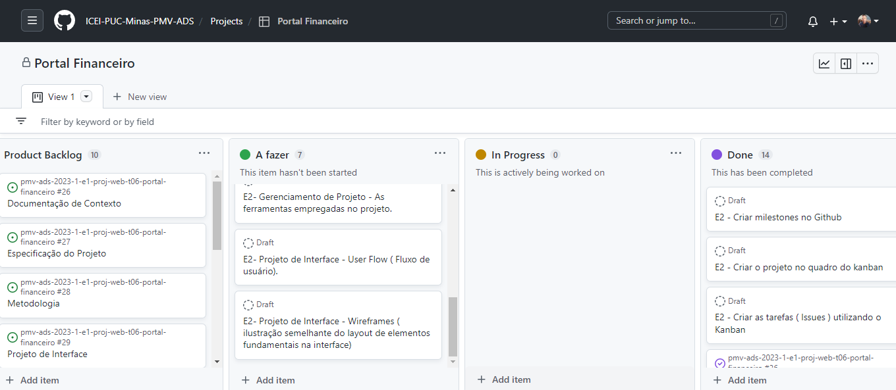

# Metodologia

Pré-requisitos: <a href="2-Especificação do Projeto.md"> Documentação de Especificação</a>

Descreva aqui a metodologia de trabalho do grupo para atacar o problema. Definições sobre os ambiente de trabalho utilizados pela  equipe para desenvolver o projeto. Abrange a relação de ambientes utilizados, a estrutura para gestão do código fonte, além da definição do processo e ferramenta através dos quais a equipe se organiza (Gestão de Times).

## Controle de Versão

A ferramenta de controle de versão adotada no projeto foi o
[Git](https://git-scm.com/), sendo que o [Github](https://github.com)
foi utilizado para hospedagem do repositório.

O projeto segue a seguinte convenção para o nome de branches:

- `main`: versão estável já testada do software
- `unstable`: versão já testada do software, porém instável
- `testing`: versão em testes do software
- `dev`: versão de desenvolvimento do software

Quanto à gerência de issues, o projeto adota a seguinte convenção para
etiquetas:

- `documentation`: melhorias ou acréscimos à documentação
- `bug`: uma funcionalidade encontra-se com problemas
- `enhancement`: uma funcionalidade precisa ser melhorada
- `feature`: uma nova funcionalidade precisa ser introduzida

Discuta como a configuração do projeto foi feita na ferramenta de versionamento escolhida. Exponha como a gerência de tags, merges, commits e branchs é realizada. Discuta como a gerência de issues foi realizada.

## Relação de Ambientes de Trabalho

Os artefatos do projeto são desenvolvidos a partir de diversas plataformas e a relação dos ambientes com seu respectivo propósito é apresentada na tabela que se segue:

|Ambiente    | Plataforma  | Link de Acesso |
|-----------|---------------------|-------------------|
|Repositório de código fonte| GitHub |https://github.com/ICEI-PUC-Minas-PMV-ADS/pmv-ads-2023-1-e1-proj-web-t06-portal-financeiro  | 
|Documentos do Projeto| GitHub | https://github.com/ICEI-PUC-Minas-PMV-ADS/pmv-ads-2023-1-e1-proj-web-t06-portal-financeiro/tree/main/docs |
|Projeto de Interface e Wireframes| Figma | https://www.figma.com/ |
|Gerenciamento de Projeto| GitHub | https://github.com/orgs/ICEI-PUC-Minas-PMV-ADS/projects/333 |

## Gerenciamento de Projeto

A equipe utiliza metodologias ágeis, tendo escolhido o Scrum como base para definição do processo de desenvolvimento.
A equipe está organizada da seguinte forma:

**Scrum Master:** Lucy Suxo

**Product Owner:** Gleyston Guimarães Silva

**Equipe de Desenvolvimento:** 
- André Fernandes Reis
- Fernando Anísio Goulart Pereira
- George Lucas Sales De Matos
- Gleyston Guimarães Silva
- Lucy Suxo
- Luiz Nader Arruda Junior

**Equipe de Design:**
- André Fernandes Reis
- Fernando Anísio Goulart Pereira
- George Lucas Sales De Matos
- Gleyston Guimarães Silva
- Lucy Suxo
- Luiz Nader Arruda Junior

Para organização e distribuição das tarefas do projeto, a equipe está utilizando o quadro de tarefas do GitHub KANBAN estruturado com as seguintes listas:

● Fazer: Esta coluna mantém as listas de tarefas a serem realizadas (seja uma funcionalidade ou artefato) pelos integrantes do grupo. Cada lista contém o título da tarefa, a descrição (contendo links) e o(os) responsável(eis);

● Em andamento: Escola coluna recebe as tarefas que estão sendo desenvolvidas pelos integrantes do grupo.

● Revisar: Demonstra as tarefas que foram executadas, mas que devem ser avaliadas e discutidas pela equipe para determinar sua atualização.

● Feito: Esta coluna representa as tarefas que já foram executadas, avaliadas e dadas como feitas.

O quadro kanban do grupo no GitHub pode ser visualizado no link:
https://github.com/orgs/ICEI-PUC-Minas-PMV-ADS/projects/333

### Processo

Coloque  informações sobre detalhes da implementação do Scrum seguido pelo grupo. O grupo poderá fazer uso de ferramentas on-line para acompanhar o andamento do projeto, a execução das tarefas e o status de desenvolvimento da solução.
 
 
### Ferramentas

Os componentes do nosso projeto são produzidos a partir de uma variedade de plataformas, cada uma com um propósito específico. Abaixo, apresentamos a relação entre os ambientes e suas respectivas funções no contexto do projeto.

* **Repositório de código fonte**: [GitHub](https://github.com/ICEI-PUC-Minas-PMV-ADS/pmv-ads-2023-1-e1-proj-web-t06-portal-financeiro)
* **Editor de código:** Visual Studio Code.
* **Ferramentas de comunicação:** Whatsapp, Teams.
* **Ferramentas de desenho de tela:** [Figma](https://www.figma.com/team_invite/redeem/m2iPoeeV0mD8wRWqAdBlXy)
* **Gerenciamento do Projeto**: [GitHub Kanban](https://github.com/orgs/ICEI-PUC-Minas-PMV-ADS/projects/333/views/1)

O editor de código foi escolhido porque ele possui uma integração com o
sistema de versão. As ferramentas de comunicação utilizadas possuem
integração semelhante e por isso foram selecionadas. Por fim, para criar
diagramas utilizamos essa ferramenta por melhor captar as
necessidades da nossa solução.

Liste quais ferramentas foram empregadas no desenvolvimento do projeto, justificando a escolha delas, sempre que possível.
 
> **Possíveis Ferramentas que auxiliarão no gerenciamento**: 
> - [Slack](https://slack.com/)
> - [Github](https://github.com/)
