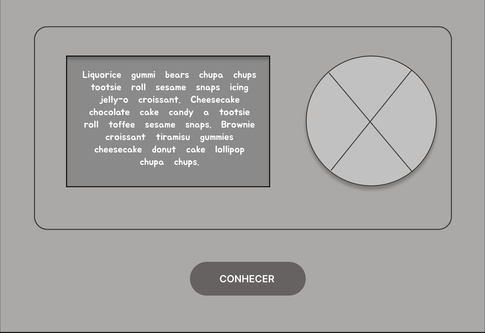
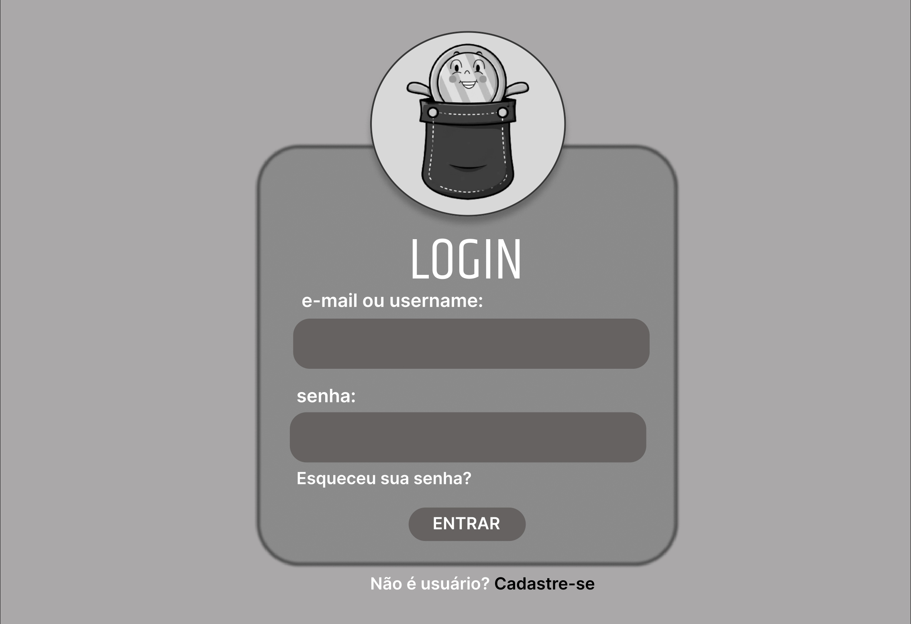
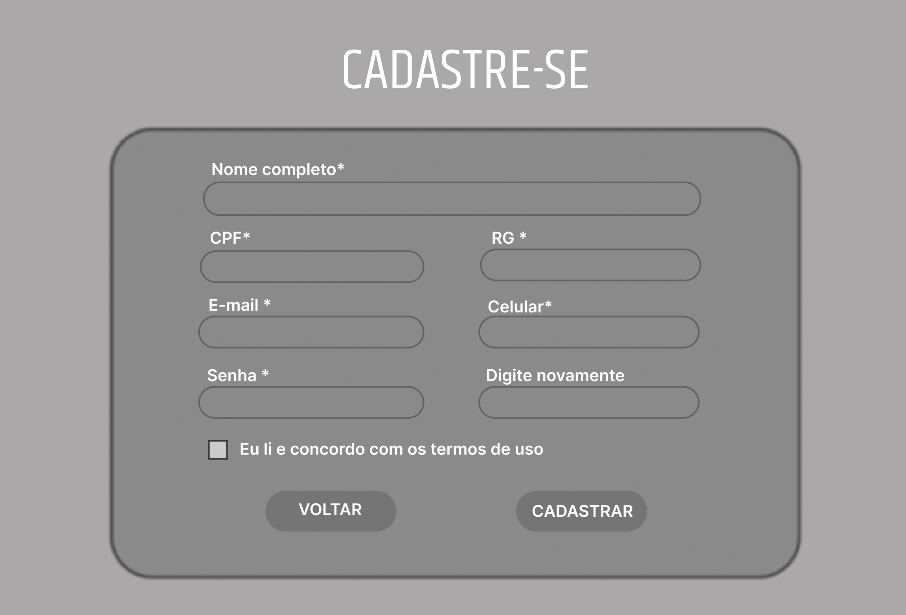
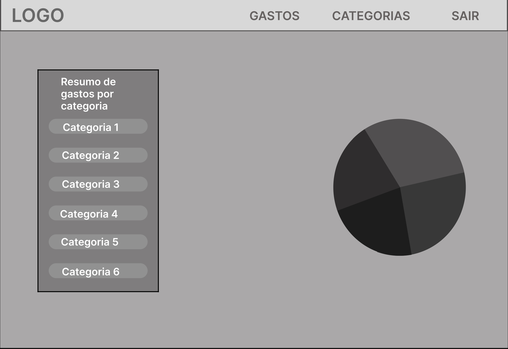
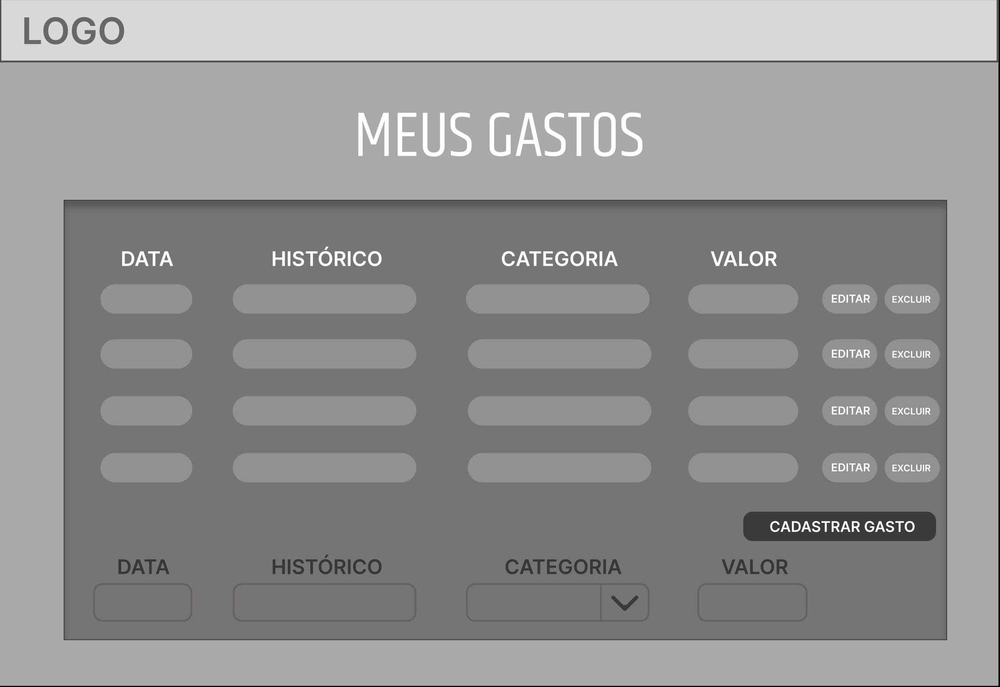
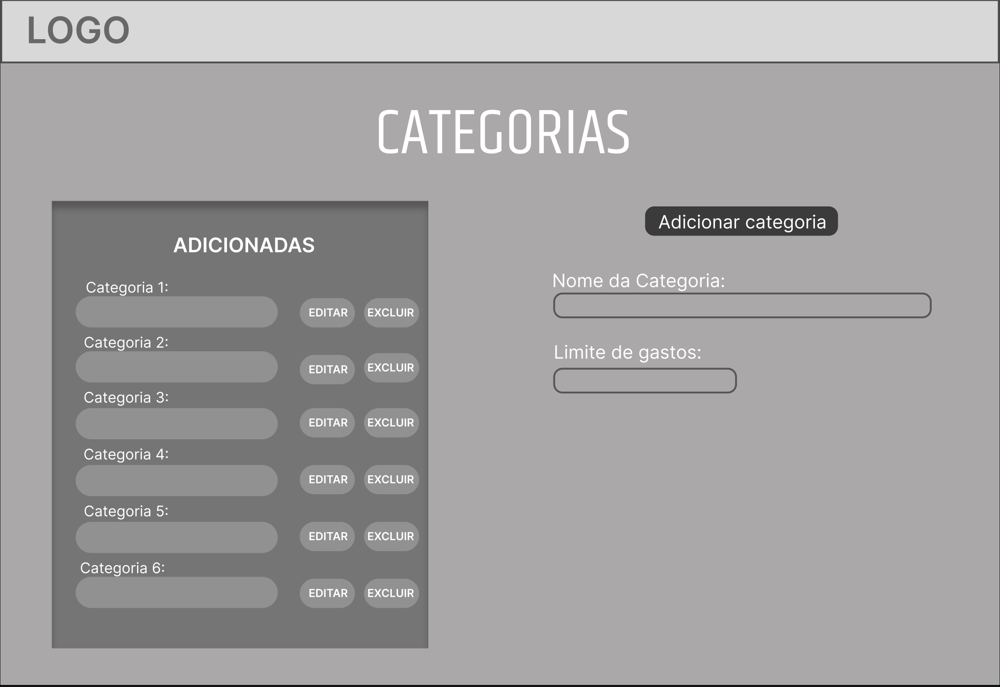

# Projeto de Interface

Visão geral da interação do usuário através das telas do sistema e protótipo interativo das funcionalidades que fazem parte do sistema (wireframes) para o projeto de controle financeiro.

Apresentação das principais interfaces da plataforma, demonstrando como elas foram elaboradas de forma a atender aos requisitos funcionais, não-funcionais e histórias de usuário descritos na Documentação de Especificação.
 
 

## User Flow

 

> **Representação visual do User Flow**
 
* **Vermelho:** Início e fim do user flow
* **Verde:** Páginas do sistema que o usuário terá acesso
* **Amarelo:** Página de menu do sistema
* **Laranja:** Decisão

 

## Wireframes

As telas descritas são parte de um sistema de controle financeiro, que permite ao usuário gerenciar seus gastos de forma organizada e eficiente.

 
<h3><ins> Tela de Apresentação </ins></h3>
 

* **Tela de Apresentação:** Nesta tela, você encontrará informações detalhadas sobre o produto, incluindo os principais recursos e funcionalidades. Isso permitirá que você entenda o que o projeto pode oferecer para ajudá-lo a controlar suas finanças de maneira eficaz.

 

 
<h3><ins> Tela de Login </ins></h3>
 

* **Tela de Login:** Criamos uma interface de login simples, onde você poderá inserir suas informações de acesso de maneira fácil e segura. Assim, você poderá acessar as funcionalidades do projeto de forma rápida e segura.

 

 
<h3><ins> Tela de Cadastro </ins></h3>
 

* **Tela de Cadastro:** O usuário tem a opção de se cadastrar no sistema, fornecendo informações pessoais que serão utilizadas para identificá-lo posteriormente. Essa etapa é fundamental para que o usuário possa ter acesso às funcionalidades do sistema.

 

 
<h3><ins> Tela de Menu </ins></h3>
 

* **Tela de Cadastro:** O usuário terá acesso ao menu com o relatório dos gastos do mês e um gráfico que mostra de forma visual as suas despesas. Isso permite que o usuário tenha uma visão geral de como está gastando o seu dinheiro e possa identificar possíveis áreas em que ele pode economizar.

 

 
<h3><ins> Tela de Gastos </ins></h3>
 

* **Tela de Gastos:** O usuário poderá adicionar todos os seus gastos, informando a data, a descrição, o valor e a categoria de cada despesa. Além disso, o usuário terá a opção de editar ou excluir as despesas já cadastradas, e também de adicionar novos gastos que não foram previstos.

 

 
<h3><ins> Tela de Categorias </ins></h3>
 

* **Tela de Categorias:** O usuário poderá inserir novas categorias de gastos e definir limites para cada uma delas. Isso permite que o usuário tenha um controle mais específico sobre suas despesas e possa identificar onde está gastando mais dinheiro. Além disso, o usuário também poderá editar ou excluir as categorias já cadastradas.
