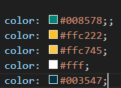

# Template padrão do site

Layout padrão do site (HTML e CSS) que será utilizado em todas as páginas com a definição de identidade visual, aspectos de responsividade e iconografia.

## Icone, Logo do site e imagem de fundo das paginas.

 

 

 

## Cores que serão utilizadas em nosso site:

 

## Login

 