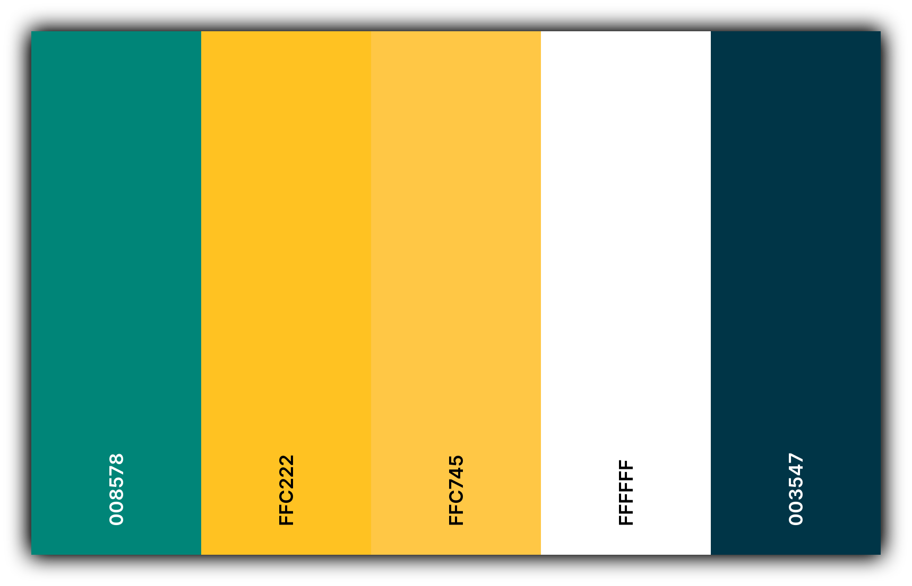

# Template padrão do site

O template do nosso sistema de controle financeiro é desenvolvido com ênfase na identidade visual, responsividade e iconografia. Ele estabelece o layout e a estrutura das páginas, assegurando consistência e proporcionando uma experiência visual agradável em todos os dispositivos.

## Ícone 

  

## Logo  

  

## Background

  

## Paleta de cores

  

## Página Inicial

  

## Login

  

## Cadastro de Usuário

  

## Menu/Relatório

  

  

  

## Cadastro de Gastos

  

## Cadastro de Categorias

  

