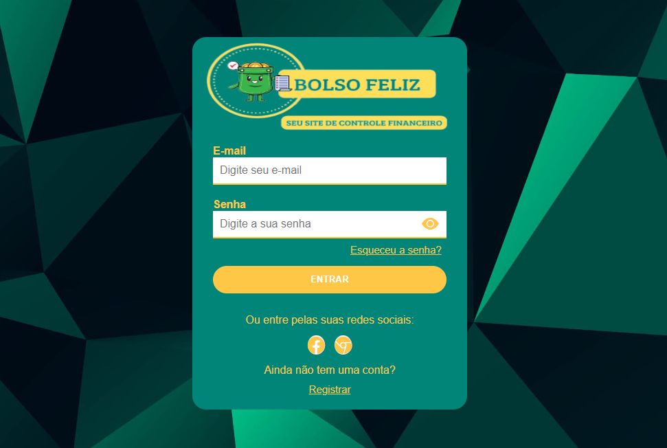
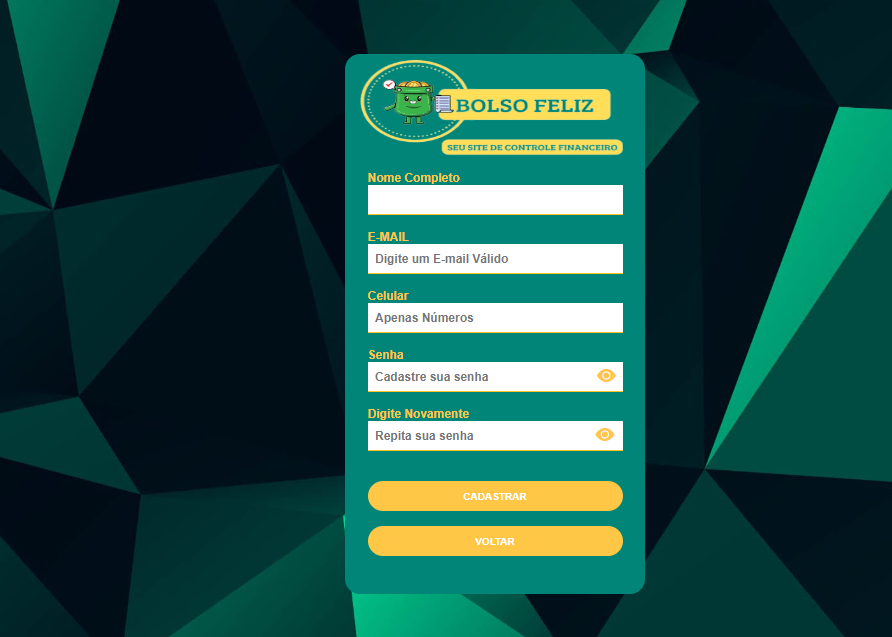
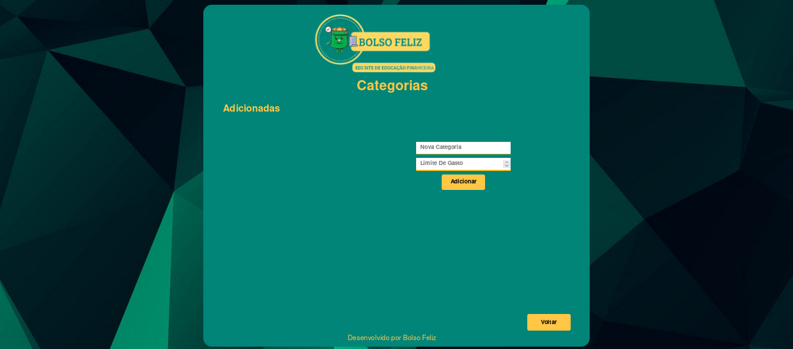

# Programação de Funcionalidades

##  Login 

Sua principal função é permitir que os usuários autentiquem suas identidades para obter acesso ao site. Através dessa página, os usuários podem inserir suas informações de login, como nome de usuário e senha, e o sistema verifica se essas informações são válidas para conceder o acesso. Disponibilizando também outros elementos na página, como botões para cadastrar um novo usuário e a opção para recuperação de senha.





### Instruções de acesso

- Abra um navegador de Internet e informe a seguinte URL: https://icei-puc-minas-pmv-ads.github.io/pmv-ads-2023-1-e1-proj-web-t06-portal-financeiro/Site/login.html

- O usuário deve preencher os campos fornecidos na tela com e-mail e senha já cadastrados e clicar em entrar.

### Requisitos Atendidos

- |RF-001| fornecer um formulário de cadastro no qual os usuários possam inserir as informações necessárias para criar uma conta.

- |RF-002| O sistema deve autenticar corretamente os usuários, verificando se as credenciais fornecidas (e-mail e senha) correspondem a um usuário válido.  

- |RF-003| fornecer uma funcionalidade de recuperação de senha que permita aos usuários redefinir suas senhas em caso de esquecimento 

- |RNF-001| O sistema deve ser fácil de usar e ter uma interface amigável para o usuário final.

### Artefatos da funcionalidade

- login.html
- login.css
- login.js

### Estrutura de dados:

```
function entrar() {

    // Iniciando login

     // Colhendo todos os valores dos elementos presentes no formulário


    var email = document.getElementById("email").value;
    var senha = document.getElementById("senha").value;
  
    // Recupera os dados do LocalStorage com base no endereço de e-mail

    var dadosString = localStorage.getItem(email);
  
    // Verifica se os dados foram encontrados

    if (dadosString) {
      // Converte a string JSON de volta para um objeto
      var dados = JSON.parse(dadosString);
  
      // Verifica se a senha fornecida corresponde à senha armazenada

      if (senha === dados.senha) {
        alert("Login realizado com sucesso!");

        window.location.href = "MeusGastos.html"
      } else {
        alert("Senha incorreta. Tente novamente.");
      }
    } else {
      alert("Usuário não encontrado. Registre-se primeiro.");

      window.location.href = "cadastro.html"
    }
  }

```


### Cadastro

A página de cadastro de usuário é uma funcionalidade que permite que novos usuários se registrem e criem uma conta para acessar e utilizar os recursos disponíveis no site. Essa página contém um formulário onde os usuários podem inserir informações pessoais, como nome, endereço de e-mail, senha, entre outros dados relevantes para o site. Essas informações são então enviadas para o servidor, onde são processadas e armazenadas em um banco de dados.




### Instruções de Acesso

- Abra o navegador da web de sua preferência (Google Chrome, Mozilla Firefox, Safari, etc.) em seu dispositivo.

- Na barra de endereço do navegador, informe a seguinte URL: https://icei-puc-minas-pmv-ads.github.io/pmv-ads-2023-1-e1-proj-web-t06-portal-financeiro/Site/cadastro.html

- Digite as credenciais pedidas para realizar seu cadastro ( Nome, Email, Telefone, Senha e a confirmação de Senha).

- Após preencher todas as informações necessárias, clique em cadastrar para que você seja redirecionado para a pagina de login.

### Requisitos Atendidos

- |RF-001| fornecer um formulário de cadastro no qual os usuários possam inserir as informações necessárias para criar uma conta. 

- |RF-002| O sistema deve autenticar corretamente os usuários, verificando se as credenciais fornecidas (e-mail e senha) correspondem a um usuário válido.  

- |RNF-001| O sistema deve ser fácil de usar e ter uma interface amigável para o usuário final.

### Artefatos da Funcionalidade

- cadastro.html
- cadastro.css
- cadastro. js

### Estrutura de Dados

```
function cadastrar() {

  // Iniciando cadastro

  // Colhendo todos os valores dos elementos presentes no formulário


  var nome = document.getElementById("nome").value;
  var email = document.getElementById("email").value;
  var celular = document.getElementById("celular").value;
  var senha = document.getElementById("senha").value;
  var confirmSenha = document.getElementById("confirmSenha").value;

  // Verifica se todos os campos foram preenchidos
  
  if (nome === "" || email === "" || celular === "" || senha === "" || confirmSenha === "") {
    alert("Por favor, preencha todos os campos.");
    return;
  }

  // Verifica se a senha e a confirmação de senha são iguais
  
  if (senha !== confirmSenha) {
    alert("A senha e a confirmação de senha não correspondem.");
    return;
  }

  // Verifica se a senha contém pelo menos uma letra e um número
  
  if (!/[a-zA-Z]/.test(senha) || !/[0-9]/.test(senha)) {
    alert("A senha deve conter pelo menos uma letra e um número.");
    return;
  }
  
  // Verifica se o campo de celular contém apenas números

  if (!/^\d{8}$/.test(celular)) {
    alert("O campo de celular deve conter de 8 a 9 digitos.");
    return;
  }
  
  // Verifica se o email contém o símbolo @

  if (!email.includes('@')) {
    alert("O email deve ser válido, contendo o caractere especial @.");
    return;
  }

  // Cria um objeto para armazenar os dados

  var dados = {
    nome: nome,
    email: email,
    celular: celular,
    senha: senha
  };

  // Converte o objeto para uma string JSON

  var dadosString = JSON.stringify(dados);

  // Armazena os dados no LocalStorage

  localStorage.setItem(email, dadosString);

  alert("Dados salvos com sucesso!");

  window.location.href = "./login.html";
}
  
function voltar(){

  window.location.href = "login.html"
}

```


##  Categorias 

A página de categorias permite ao usuário adicionar, editar ou excluir categorias que serão utilizadas para classificar e organizar suas transações financeiras. Essas categorias podem representar diferentes tipos de despesas, receitas ou classificações específicas do usuário. Ajudando o usuário a obter uma visão geral de como estão utilizando seu dinheiro.




### Instruções de acesso

- Abra um navegador de Internet e informe a seguinte URL: https://icei-puc-minas-pmv-ads.github.io/pmv-ads-2023-1-e1-proj-web-t06-portal-financeiro/Site/categorias.html

### Requisitos Atendidos

- |RF-006|  Permitir que o usuário defina limites de gastos para cada categoria de despesas.

- |RNF-001| O sistema deve ser fácil de usar e ter uma interface amigável para o usuário final.

- |RNF-002| O sistema deve ter um tempo de resposta rápido para permitir que o usuário atualize as informações de gastos do dia a dia em tempo real.

- |RNF-004| O sistema deve ser responsivo para proporcionar a melhor experiência ao usuário em qualquer dispositivo.

- |RNF-005| O site deve ser compatível com os principais navegadores do mercado (Google Chrome, Firefox, Microsoft Edge).


### Artefatos da funcionalidade

- categorias.html
- categorias.css
- categorias.js

### Estrutura de dados:

```
var editando = "";
var elementContainer = document.getElementById('element-container');
var dadoscategoria = JSON.parse(localStorage.getItem('categorias')) || [];
var btnAdd = document.querySelector('.bnt-add');
load();

function save() {
  localStorage.setItem('categorias', JSON.stringify(dadoscategoria));
}

function addcategoria() {
  var nome = document.getElementById('textInput').value;
  var limite = document.getElementById('NumberInput').value;

  if (validarCamposVazios(nome, limite) == false) {
    if (validar(nome) == false) {
      var nova = {
        nome: PrimeiraLetraMaiusc(nome), limite: limite
      }
      dadoscategoria.push(nova);
      save();
      load();
    }
  }
}
btnAdd.addEventListener('click', addcategoria);

function limpar(nome) {
  dadoscategoria.forEach((categoria, index) => {
    if (categoria.nome.toLowerCase() === nome.toLowerCase()) {
      dadoscategoria.splice(index, 1)
      load()
      save()
    }
  });
}

function editar() {
  var nomenovo = document.getElementById('nomenovo').value;
  var valornovo = document.getElementById('valornovo').value;
  if (validarCamposVazios(nomenovo, valornovo) == false) {
    if (nomenovo == editando || validar(nomenovo) == false) {
      dadoscategoria.forEach((categoria, index) => {
        if (categoria.nome == editando) {
          categoria.nome = nomenovo
          categoria.limite = valornovo
          categoria.nome = PrimeiraLetraMaiusc(nomenovo);
          load()
          save()
        }
      });
      popup();
      document.getElementById('nomenovo').value = '';
      document.getElementById('valornovo').value = '';
    }
  }
}

function abrirpopup(categoria) {
  document.getElementById('nomenovo').value = categoria.nome;
  document.getElementById('valornovo').value = categoria.limite;
  var popup = document.getElementById("popup");
  popup.classList.toggle("active");
}

function popup() {
  var popup = document.getElementById("popup");
  popup.classList.toggle("active");
}

function load() {
  elementContainer.innerHTML = "";
  dadoscategoria.forEach(categoria => {
    var novaDiv = document.createElement('div');
    novaDiv.classList.add('element');
    var textDiv = document.createElement('div');
    textDiv.classList.add('element-text');
    textDiv.textContent = categoria.nome + ' Limite:R$' + categoria.limite;

    var buttonContainer = document.createElement('div');
    buttonContainer.classList.add('button-container');

    var editButton = document.createElement('button');
    editButton.classList.add('edit-btn');
    editButton.addEventListener('click', function () {
      abrirpopup(categoria);
      editando = categoria.nome;
    });

    var deleteButton = document.createElement('button');
    deleteButton.classList.add('delete-btn');
    deleteButton.addEventListener('click', function () {
      limpar(categoria.nome);
    });

    buttonContainer.appendChild(editButton);
    buttonContainer.appendChild(deleteButton);

    novaDiv.appendChild(textDiv);
    novaDiv.appendChild(buttonContainer);

    elementContainer.appendChild(novaDiv);
    document.getElementById('textInput').value = '';
    document.getElementById('NumberInput').value = '';

  });
}

function validarCamposVazios(nome, limite) {
  var error = false;
  if (nome == "" || limite == "") { error = true }
  return error;
};

function validar(nome) {
  var error = false;
  dadoscategoria.forEach(function (element) {
    if (element.nome.toLowerCase() === nome.toLowerCase()) {
      error = true;
    }
  });
  return error;
};

function PrimeiraLetraMaiusc(string) {
  return string.charAt(0).toUpperCase() + string.slice(1);
}

function voltarPagina() {
  window.location.href = "../Site/MeusGastos.html";
}

```
