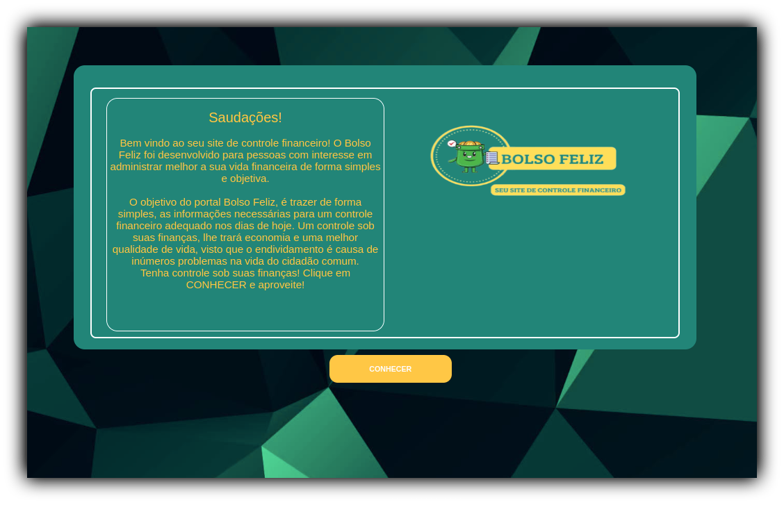
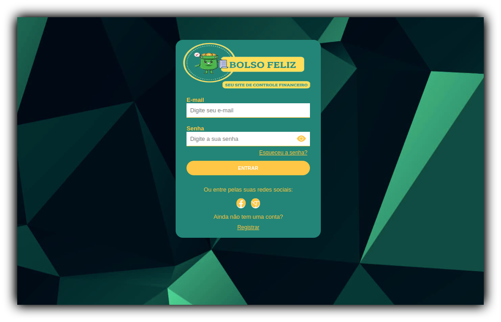
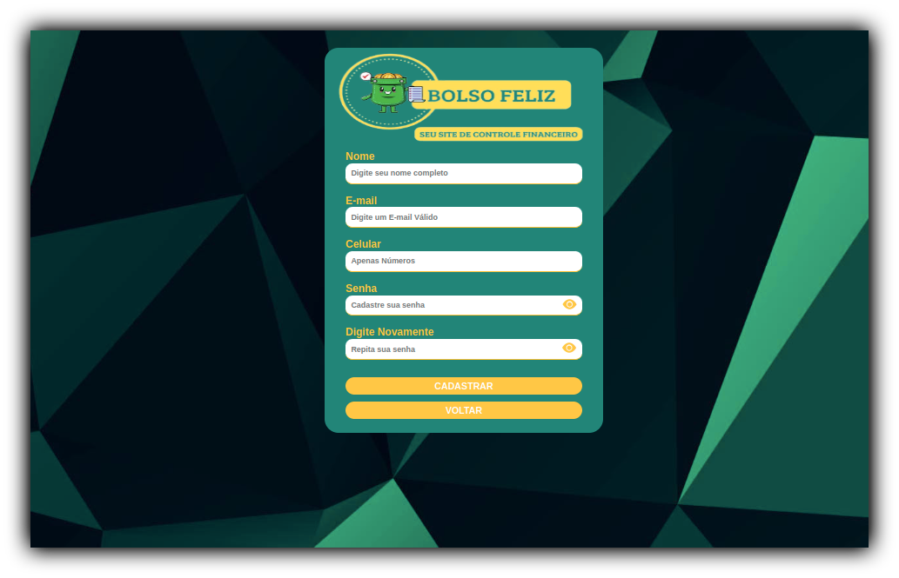
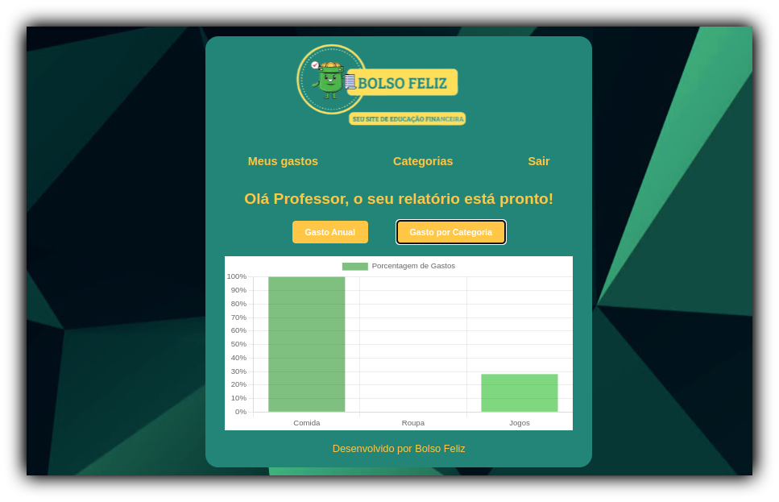
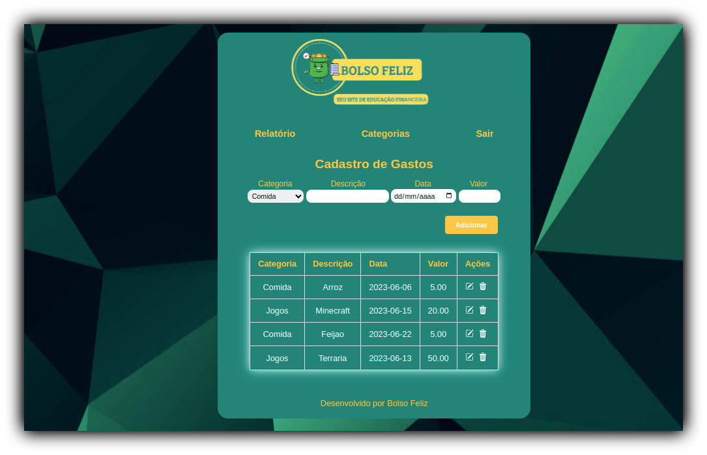
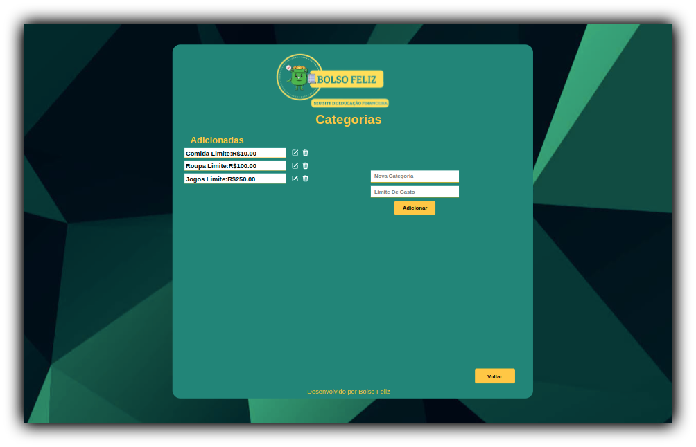

# Programação de Funcionalidades
O documento de programação de funcionalidades descreve as características principais de cada página do sistema. Em cada seção, haverá uma imagem representativa da página e serão fornecidas instruções de acesso, requisitos atendidos, artefatos relacionados à funcionalidade e estruturas de dados utilizadas.

<br>

##  Página Inicial

A página inicial é o ponto de partida para explorar o que oferecemos. Nela, você encontrará uma breve descrição do nosso site e seus principais recursos. Nosso objetivo é proporcionar uma experiência incrível aos usuários, com facilidade de uso, informações relevantes e soluções eficazes para suas necessidades. Você será convidado a explorar o site e descobrir o que nos torna únicos, com um botão destacado para iniciar essa jornada. 





### Instruções de acesso

- Abra um navegador de Internet e informe a seguinte URL: https://icei-puc-minas-pmv-ads.github.io/pmv-ads-2023-1-e1-proj-web-t06-portal-financeiro/Site/Apresentacao.html

- Na página inicial, clique no botão "CONHECER" para explorar o que o site tem a oferecer.

<br>

### Requisitos Atendidos

- |RNF-001| O sistema deve ser fácil de usar e ter uma interface amigável para o usuário final.

- |RNF-004| O sistema deve ser responsivo para proporcionar a melhor experiência ao usuário em qualquer dispositivo.

- |RNF-005| O site deve ser compatível com os principais navegadores do mercado (Google Chrome, Firefox, Microsoft Edge).

<br>

### Artefatos da funcionalidade

- Apresentacao.html
- Aprentacao.css
- Apresentacao.js

<br>

### Estrutura de dados:

```
 // Está página não possui uma estrutura de dados
```
<br>

##  Login 


Sua principal função é permitir que os usuários autentiquem suas identidades para obter acesso ao site. Através dessa página, os usuários podem inserir suas informações de login, como nome de usuário e senha, e o sistema verifica se essas informações são válidas para conceder o acesso. Disponibilizando também outros elementos na página, como botões para cadastrar um novo usuário e a opção para recuperação de senha.





### Instruções de acesso

- Abra um navegador de Internet e informe a seguinte URL: https://icei-puc-minas-pmv-ads.github.io/pmv-ads-2023-1-e1-proj-web-t06-portal-financeiro/Site/login.html

- Se preferir, acesse a página inicial do site e clique no botão "CONHECER" para ser redirecionado para a página de login. 

- O usuário deve preencher os campos fornecidos na tela com e-mail e senha já cadastrados e clicar em entrar.

- Caso ainda não tenha uma conta, clique em "REGISTRAR" na página de login para ser redirecionado a página de cadastro. 

<br>

### Requisitos Atendidos

- |RF-001| fornecer um formulário de cadastro no qual os usuários possam inserir as informações necessárias para criar uma conta.

- |RF-002| O sistema deve autenticar corretamente os usuários, verificando se as credenciais fornecidas (e-mail e senha) correspondem a um usuário válido.  

- |RF-003| fornecer uma funcionalidade de recuperação de senha que permita aos usuários redefinir suas senhas em caso de esquecimento 

- |RNF-001| O sistema deve ser fácil de usar e ter uma interface amigável para o usuário final.

<br>

### Artefatos da funcionalidade

- login.html
- login.css
- login.js

<br>

### Estrutura de dados:

```
 // Está página não possui uma estrutura de dados
```

<br>

## Cadastro


A página de cadastro de usuário é uma funcionalidade que permite que novos usuários se registrem e criem uma conta para acessar e utilizar os recursos disponíveis no site. Essa página contém um formulário onde os usuários podem inserir informações pessoais, como nome, endereço de e-mail, senha, entre outros dados relevantes para o site. Essas informações são então enviadas para o servidor, onde são processadas e armazenadas em um banco de dados.




### Instruções de Acesso

- Abra o navegador da web de sua preferência (Google Chrome, Mozilla Firefox, Safari, etc.) em seu dispositivo.

- Na barra de endereço do navegador, informe a seguinte URL: https://icei-puc-minas-pmv-ads.github.io/pmv-ads-2023-1-e1-proj-web-t06-portal-financeiro/Site/cadastro.html

- Caso você não queira acessar diretamente pelo URL, você pode ser redirecionado para a página de cadastro através da página de login. 

- Digite as credenciais pedidas para realizar seu cadastro ( Nome, Email, Telefone, Senha e a confirmação de Senha).

- Após preencher todas as informações necessárias, clique em cadastrar para que você seja redirecionado para a pagina de login.

<br>

### Requisitos Atendidos

- |RF-001| fornecer um formulário de cadastro no qual os usuários possam inserir as informações necessárias para criar uma conta. 

- |RF-002| O sistema deve autenticar corretamente os usuários, verificando se as credenciais fornecidas (e-mail e senha) correspondem a um usuário válido.  

- |RNF-001| O sistema deve ser fácil de usar e ter uma interface amigável para o usuário final.

<br>

### Artefatos da Funcionalidade

- cadastro.html
- cadastro.css
- cadastro.js

<br>

### Estrutura de Dados

```
[{
  "celular": "String",
  "email": "String",
  "nome": "String",
  "senha": "String"
  },
{
  "celular": "1199999999",
  "email": "lucy@mail.com",
  "nome": "Lucy",
  "senha": "123A"
  }]
```

<br>

##  Menu/Relatório


A página de menu/relatório é uma parte essencial do site, oferecendo aos usuários acesso a gráficos interativos. Nessa página, os usuários podem explorar dados por meio de gráficos dinâmicos gerados com base em suas interações. Além disso, a página fornece rotas para outras seções do site, permitindo que os usuários naveguem facilmente para diferentes páginas, como "Meus Gastos" e "Categorias". Também é disponibilizado um botão para sair/deslogar, proporcionando aos usuários a opção de encerrar sua sessão quando desejarem. 




### Instruções de acesso

- Abra um navegador de Internet e informe a seguinte URL: https://icei-puc-minas-pmv-ads.github.io/pmv-ads-2023-1-e1-proj-web-t06-portal-financeiro/Site/menu.html

- Se preferir, faça o login em sua conta. Após o login bem-sucedido, você será redirecionado automaticamente para a página de menu.

- Para visualizar os gastos anuais, clique no botão "Gastos Anuais". 

- Para visualizar os gastos por categorias, clique no botão "Gastos por Categoria".

- Se desejar ir para outras seções do site, basta clicar nas opções do navbar, que está localizada na parte superior da página.

- Caso queira sair da sessão atual, clique no botão "Sair".

<br>

### Requisitos Atendidos

- |RF-007| Permitir que o usuário visualize um resumo mensal de seus gastos.

- |RNF-001| O sistema deve ser fácil de usar e ter uma interface amigável para o usuário final.

- |RNF-002| O sistema deve ter um tempo de resposta rápido para permitir que o usuário atualize as informações de gastos do dia a dia em tempo real.

- |RNF-004| O sistema deve ser responsivo para proporcionar a melhor experiência ao usuário em qualquer dispositivo.

- |RNF-005| O site deve ser compatível com os principais navegadores do mercado (Google Chrome, Firefox, Microsoft Edge).

<br>

### Artefatos da funcionalidade

- menu.html
- menu.css
- menu.js

<br>

### Estrutura de dados:

```
  // Está página não possui uma estrutura de dados
```

<br>


## Meus Gastos


A página de cadastro de gastos permite ao usuário registrar suas despesas pessoais de forma simples e conveniente. Nela, é possível selecionar a categoria, adicionar uma descrição, inserir a data e informar o valor do gasto. Os registros são exibidos em uma tabela, onde o usuário pode editar ou excluir as entradas existentes. Essas opções de edição e exclusão garantem que o usuário tenha total controle sobre seus registros financeiros. Com uma interface intuitiva e recursos práticos, a página de cadastro de gastos é uma ferramenta eficaz para o gerenciamento das despesas pessoais.




### Instruções de Acesso

- Abra o navegador da web de sua preferência (Google Chrome, Mozilla Firefox, Safari, etc.) em seu dispositivo.

- Na barra de endereço do navegador, informe a seguinte URL: https://icei-puc-minas-pmv-ads.github.io/pmv-ads-2023-1-e1-proj-web-t06-portal-financeiro/Site/MeusGastos.html

- Você também pode acessar a página de cadastro de gastos através das opções do menu, após fazer o login. 

- Na página, selecione uma categoria previamente cadastrada, preencha a descrição, a data utilizando o calendário e insira o valor do gasto.

- Após preencher todos os campos, clique no botão "Adicionar" para registrar o gasto.

- Se precisar corrigir algum erro, utilize o ícone de edição para abrir um popup e realizar as alterações necessárias. 

- Para excluir um registro de gasto, clique no ícone de lixeira correspondente ao gasto desejado. O registro será deletado permanentemente.

<br>

### Requisitos Atendidos

- |RF-004| Permitir que o usuário crie um orçamento mensal para controlar seus gastos.

- |RF-005| Permitir que o usuário insira e classifique despesas do dia a dia, como alimentação, transporte e compras. 

- |RNF-001| O sistema deve ser fácil de usar e ter uma interface amigável para o usuário final. 

- |RNF-002| O sistema deve ter um tempo de resposta rápido para permitir que o usuário atualize as informações de gastos do dia a dia em tempo real.

- |RNF-004| O sistema deve ser responsivo para proporcionar a melhor experiência ao usuário em qualquer dispositivo.

- |RNF-005| O site deve ser compatível com os principais navegadores do mercado (Google Chrome, Firefox, Microsoft Edge).	

<br>

### Artefatos da Funcionalidade

- MeusGastos.html
- MeusGastos.css
- MeusGastos.js

<br>

### Estrutura de Dados

```
[{
  "categoria": "String",
  "descricao": "String",
  "data": "String Date",
  "valor": Float
  },
{
  "categoria": "Jogos",
  "descricao": "Minecraft",
  "data": "2023-06-10",
  'valor": 50.00
  
  }]

```

<br>

##  Categorias 

A página de categorias permite ao usuário adicionar, editar ou excluir categorias que serão utilizadas para classificar e organizar suas transações financeiras. Essas categorias podem representar diferentes tipos de despesas, receitas ou classificações específicas do usuário. Ajudando o usuário a obter uma visão geral de como estão utilizando seu dinheiro.




### Instruções de acesso

- Abra um navegador de Internet e informe a seguinte URL: https://icei-puc-minas-pmv-ads.github.io/pmv-ads-2023-1-e1-proj-web-t06-portal-financeiro/Site/categorias.html

### Requisitos Atendidos

- |RF-006|  Permitir que o usuário defina limites de gastos para cada categoria de despesas.

- |RNF-001| O sistema deve ser fácil de usar e ter uma interface amigável para o usuário final.

- |RNF-002| O sistema deve ter um tempo de resposta rápido para permitir que o usuário atualize as informações de gastos do dia a dia em tempo real.

- |RNF-004| O sistema deve ser responsivo para proporcionar a melhor experiência ao usuário em qualquer dispositivo.

- |RNF-005| O site deve ser compatível com os principais navegadores do mercado (Google Chrome, Firefox, Microsoft Edge).


### Artefatos da funcionalidade

- categorias.html
- categorias.css
- categorias.js

### Estrutura de dados:

```
[{
  "nome": "String",
  "limite": Float
  },
{
 "nome": "Jogos",
 "limite": 250.00
  }]

```
