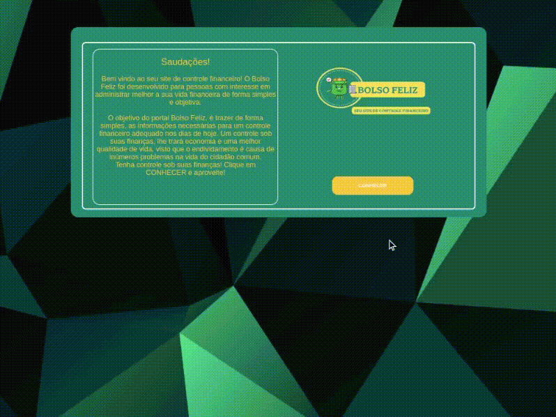
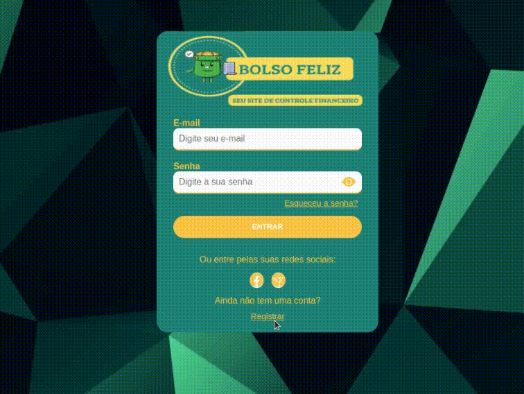

# Registro de Testes de Software

Pré-requisitos: <a href="3-Projeto de Interface.md"> Projeto de Interface</a>, <a href="8-Plano de Testes de Software.md"> Plano de Testes de Software</a>

Relatório com as evidências dos testes de software realizados no sistema pela equipe, baseado em um plano de testes pré-definido.

## Cenário de Teste: Página Inicial - Redirecionamento para a página de Login

**Objetivo:** Verificar se o redirecionamento da página inicial para a página de login está funcionando corretamente.

 

**Descrição:** O teste foi realizado para validar se, ao clicar no botão "Conhecer" na página inicial, o usuário é redirecionado corretamente para a página de login do sistema Bolso Feliz.

 

**Passos do Teste:**
- Acessar a página inicial do sistema Bolso Feliz.
- Localizar o botão "Conhecer" na página inicial.
- Clicar no botão "Conhecer" para iniciar o redirecionamento.
- Verificar se o usuário é redirecionado para a página de login do sistema.

 

 **Resultados:**
- No teste realizado, o redirecionamento da página inicial para a página de login funcionou corretamente.
- Ao clicar no botão "Conhecer", o usuário foi redirecionado para a página de login do sistema.

 

**Evidência:**

  

 

## Cenário de Teste: Cadastro de Novo Usuário

**Objetivo:** Verificar se o processo de cadastro de novo usuário está funcionando corretamente, permitindo que os usuários preencham os campos necessários e sejam redirecionados para a página de login.

 

**Descrição:** O teste foi realizado para validar se o processo de cadastro de novo usuário no sistema Bolso Feliz está operando corretamente. Foram preenchidos os campos obrigatórios de nome, e-mail, número de telefone, senha e confirmação de senha, e verificou-se se o redirecionamento para a página de login ocorre após o cadastro.

 

**Passos do Teste:**
- Acessar a página de cadastro de novo usuário do sistema Bolso Feliz.
- Preencher os campos de nome, e-mail, número de telefone, senha e confirmação de senha com informações válidas.
- Clicar no botão "Cadastrar" para registrar os dados do novo usuário.
- Verificar se o usuário é redirecionado para a página de login do sistema.

 

 **Resultados:**
- No teste realizado, o processo de cadastro de novo usuário funcionou corretamente.
- Os campos de nome, e-mail, número de telefone, senha e confirmação de senha foram preenchidos corretamente.
- Após o cadastro, o usuário foi redirecionado para a página de login do sistema.

 

**Evidência:**

  

 

## Cenário de Teste: Login de Usuário

**Objetivo:** Verificar se o processo de login de usuário está funcionando corretamente, permitindo que os usuários acessem suas contas com credenciais válidas.

 

**Descrição:** O teste foi realizado para validar se o processo de login de usuário no sistema Bolso Feliz está operando corretamente. Foram inseridas informações de login corretas e verificou-se se o acesso foi concedido ao sistema.
 

**Passos do Teste:**
- Acessar a página de login do sistema Bolso Feliz.
- Preencher os campos de e-mail e senha com credenciais válidas de um usuário registrado.
- Clicar no botão de login para autenticar as informações de login.
- Verificar se o acesso ao sistema é concedido após o login.

 

 **Resultados:**
- No teste realizado, o processo de login de usuário funcionou corretamente.
- As informações de e-mail e senha foram inseridas corretamente.
- Após o login, o acesso ao sistema foi concedido.

 

**Evidência:**

  

 

## Avaliação

Discorra sobre os resultados do teste. Ressaltando pontos fortes e fracos identificados na solução. Comente como o grupo pretende atacar esses pontos nas próximas iterações. Apresente as falhas detectadas e as melhorias geradas a partir dos resultados obtidos nos testes.

> **Links Úteis**:
> - [Ferramentas de Test para Java Script](https://geekflare.com/javascript-unit-testing/)
