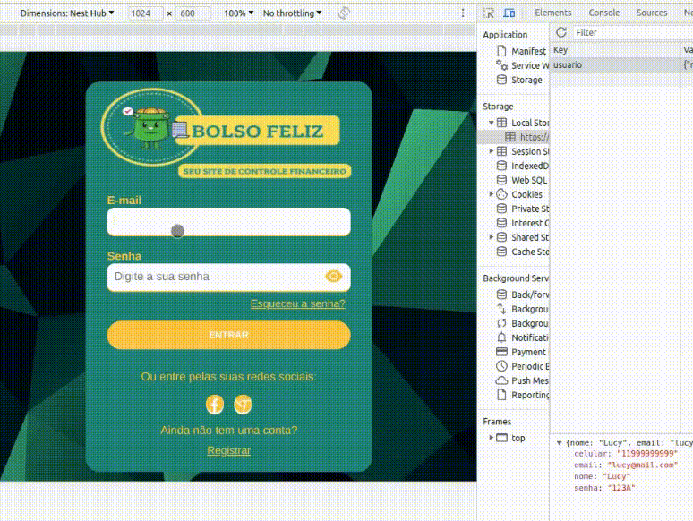
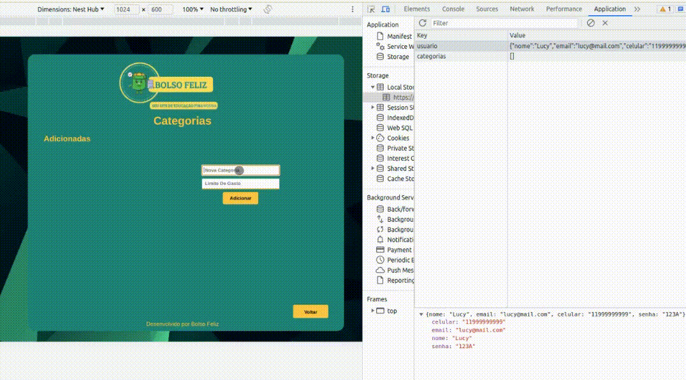
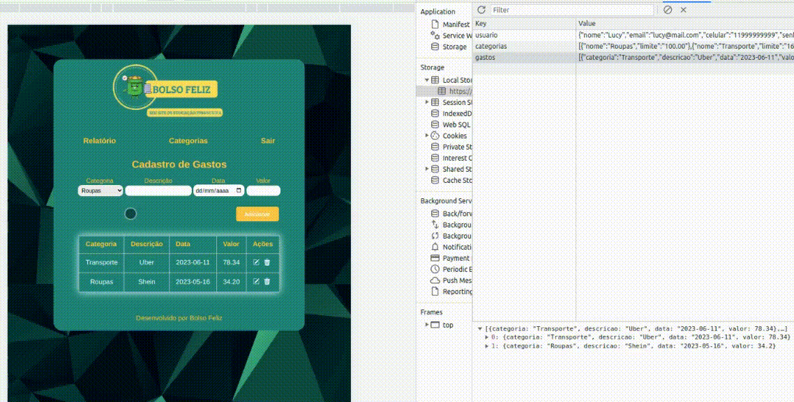
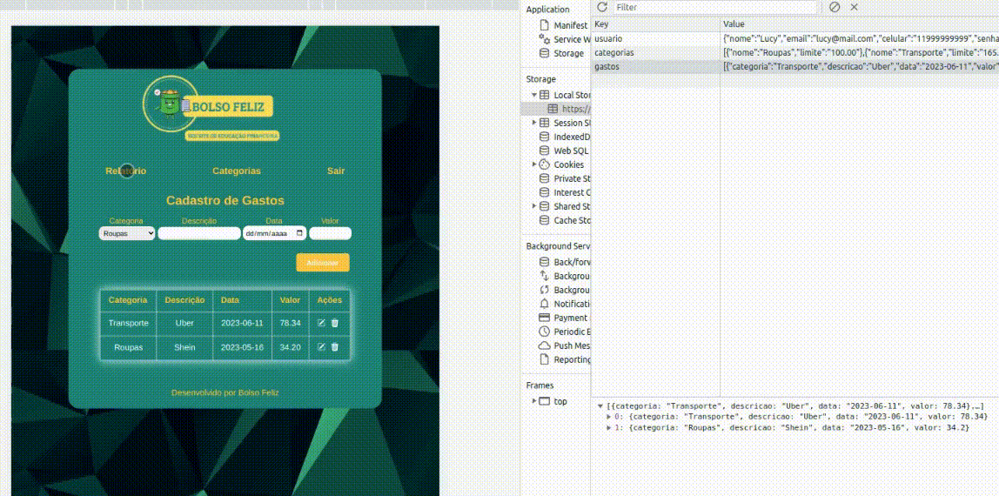

# Registro de Testes de Software

Abaixo, você encontrará os registros dos testes realizados no sistema Bolso Feliz, juntamente com informações sobre os objetivos, descrições, passos executados, resultados obtidos e evidências. Para uma melhor visualização, incluímos gifs interativos que permitem acompanhar de forma mais dinâmica o processo de teste.
Através desses registros, podemos analisar detalhadamente cada etapa dos testes e compartilhar as evidências de forma clara e interativa.

Equipe de Teste: Lucy Suxo e Gleyston Guimarães.

## Cenário de Teste: Página Inicial - Redirecionamento para a página de Login

**Objetivo:** Verificar se o redirecionamento da página inicial para a página de login está funcionando corretamente.

 

**Descrição:** O teste foi realizado para validar se, ao clicar no botão "Conhecer" na página inicial, o usuário é redirecionado corretamente para a página de login do sistema Bolso Feliz.

 

**Passos do Teste:**
- Acessar a página inicial do sistema Bolso Feliz.
- Localizar o botão "Conhecer" na página inicial.
- Clicar no botão "Conhecer" para iniciar o redirecionamento.
- Verificar se o usuário é redirecionado para a página de login do sistema.

 

 **Resultados:**
- No teste realizado, o redirecionamento da página inicial para a página de login funcionou corretamente.
- Ao clicar no botão "Conhecer", o usuário foi redirecionado para a página de login do sistema.

 

**Evidência:**

  

 

## Cenário de Teste: Cadastro de Novo Usuário

**Objetivo:** Verificar se o processo de cadastro de novo usuário está funcionando corretamente, permitindo que os usuários preencham os campos necessários e sejam redirecionados para a página de login.

 

**Descrição:** O teste foi realizado para validar se o processo de cadastro de novo usuário no sistema Bolso Feliz está operando corretamente. Foram preenchidos os campos obrigatórios de nome, e-mail, número de telefone, senha e confirmação de senha, e verificou-se se o redirecionamento para a página de login ocorre após o cadastro.

 

**Passos do Teste:**
- Acessar a página de cadastro de novo usuário do sistema Bolso Feliz.
- Preencher os campos de nome, e-mail, número de telefone, senha e confirmação de senha com informações válidas.
- Clicar no botão "Cadastrar" para registrar os dados do novo usuário.
- Verificar se o usuário é redirecionado para a página de login do sistema.

 

 **Resultados:**
- No teste realizado, o processo de cadastro de novo usuário funcionou corretamente.
- Os campos de nome, e-mail, número de telefone, senha e confirmação de senha foram preenchidos corretamente.
- Após o cadastro, o usuário foi redirecionado para a página de login do sistema.

 

**Evidência:**

  

 

## Cenário de Teste: Login de Usuário

**Objetivo:** Verificar se o processo de login de usuário está funcionando corretamente, permitindo que os usuários acessem suas contas com credenciais válidas.

 

**Descrição:** O teste foi realizado para validar se o processo de login de usuário no sistema Bolso Feliz está operando corretamente. Foram inseridas informações de login corretas e verificou-se se o acesso foi concedido ao sistema.

 

**Passos do Teste:**
- Acessar a página de login do sistema Bolso Feliz.
- Preencher os campos de e-mail e senha com credenciais válidas de um usuário registrado.
- Clicar no botão de login para autenticar as informações de login.
- Verificar se o acesso ao sistema é concedido após o login.

 

 **Resultados:**
- No teste realizado, o processo de login de usuário funcionou corretamente.
- As informações de e-mail e senha foram inseridas corretamente.
- Após o login, o acesso ao sistema foi concedido.
- Quando credenciais inválidas foram fornecidas, uma notificação de credenciais inválidas foi exibida corretamente.

 

**Evidência:**

  

 

## Cenário de Teste: Adicionar Categoria

**Objetivo:** Verificar se a funcionalidade de adicionar categoria está funcionando corretamente, permitindo que os usuários do sistema Bolso Feliz adicionem novas categorias para organizar seus gastos.

 

**Descrição:** O teste foi realizado para validar a funcionalidade de adicionar categoria no sistema Bolso Feliz. Foram inseridas informações de categoria válidas, incluindo o nome da categoria e o limite de gastos. Em seguida, verificou-se se a nova categoria foi adicionada com sucesso ao sistema. Também foi verificado se é possível editar o nome ou o limite da categoria, e se é possível deletar categorias existentes. Após a adição das categorias, foi testado o botão de voltar, que redireciona para a página de cadastro de gastos.

 

**Passos do Teste:**
- Acessar a página de gerenciamento de categorias do sistema Bolso Feliz.
- Verificar se a lista de categorias existentes é exibida corretamente.
- Inserir um nome válido no campo "Nome da Categoria".
- Inserir um limite de gastos válido no campo "Limite de Gasto".
- Clicar no botão de adicionar categoria para salvar a nova categoria.
- Verificar se a nova categoria foi adicionada à lista de categorias existentes.
- Testar a funcionalidade de edição, alterando o nome ou o limite da categoria.
- Verificar se as alterações realizadas na categoria foram salvas corretamente.
- Testar a funcionalidade de deleção, removendo uma categoria existente.
- Clicar no botão de voltar para retornar à página de cadastro de gastos.
- Verificar se o redirecionamento para a página de cadastro de gastos ocorre corretamente.

 

 **Resultados:**
- No teste realizado, a funcionalidade de adicionar categoria funcionou corretamente.
- As informações de categoria, incluindo nome e limite de gastos, foram inseridas corretamente.
- Todas as categorias adicionadas foram salvas com sucesso no sistema.
- A lista de categorias existentes foi atualizada corretamente após a adição das novas categorias.
- A funcionalidade de edição permitiu alterar o nome e o limite da categoria corretamente.
- A funcionalidade de deleção permitiu remover categorias existentes com sucesso.
- O botão de voltar redirecionou corretamente para a página de cadastro de gastos.

 

**Evidência:**

  

 

## Cenário de Teste: Adicionar Gasto

**Objetivo:** Verificar se a funcionalidade de adicionar gasto está funcionando corretamente no sistema Bolso Feliz. O objetivo é inserir informações válidas de compra, incluindo a categoria previamente cadastrada, descrição, data e valor. Será verificado se o valor da compra não ultrapassa o limite estabelecido na categoria. Além disso, serão testadas as funcionalidades de edição e exclusão do gasto adicionado.

 

**Descrição:** O teste foi realizado para validar a funcionalidade de adicionar gasto no sistema Bolso Feliz. Inicialmente, foi escolhida uma categoria previamente cadastrada na página de cadastro de categorias. Em seguida, foram inseridas informações válidas de descrição, data e valor da compra. Durante o teste, foi verificado se o valor da compra não ultrapassou o limite estabelecido na categoria selecionada. Após a adição do gasto, foram testadas as funcionalidades de edição e exclusão, para garantir que os gastos adicionados possam ser modificados ou removidos corretamente.

 

**Passos do Teste:**
- Acessar a página de cadastro de gastos do sistema Bolso Feliz.
- Verificar se a lista de gastos existentes é exibida corretamente.
- Escolher a categoria previamente cadastrada na página de cadastro de categorias.
- Inserir uma descrição válida no campo "Descrição".
- Inserir uma data válida no campo "Data".
- Inserir um valor válido no campo "Valor".
- Clicar no botão de adicionar gasto para salvar a nova compra.
- Verificar se o valor da compra não ultrapassa o limite estabelecido na categoria selecionada.
- Verificar se o gasto foi adicionado corretamente à tabela de gastos existentes.
- Verificar se as alterações realizadas no gasto foram salvas corretamente.
- Verificar se o gasto foi removido com sucesso da lista de gastos existentes.

 

 **Resultados:**
- No teste realizado, a funcionalidade de adicionar gasto funcionou corretamente.
- As informações de compra, incluindo categoria, descrição, data e valor, foram inseridas corretamente.
- O sistema verificou corretamente se o valor da compra não ultrapassou o limite estabelecido na categoria selecionada.
- O gasto adicionado foi exibido corretamente na tabela de gastos existentes.
- A funcionalidade de edição permitiu alterar a descrição ou o valor do gasto corretamente.
- As alterações realizadas no gasto foram salvas corretamente no sistema.
- A funcionalidade de exclusão permitiu remover o gasto adicionado com sucesso da lista.

 

**Evidência:**

  

 

## Cenário de Teste: Visualizar Relatório Anual

**Objetivo:** Verificar se a funcionalidade de visualizar o relatório anual está funcionando corretamente no sistema Bolso Feliz. O objetivo é acessar o relatório anual de gastos, que exibe um gráfico com a soma dos gastos de cada mês ao longo do ano. Será testado o comportamento do botão "Gasto Anual" para exibir e ocultar o gráfico.

 

**Descrição:** O teste foi realizado para validar a funcionalidade de visualizar o relatório anual no sistema Bolso Feliz. Ao clicar no botão "Gasto Anual", o gráfico com a soma dos gastos mensais é exibido. Ao clicar novamente no botão, o gráfico deve ser ocultado. Durante o teste, foi verificado se o gráfico exibido apresenta corretamente a soma dos gastos de cada mês, representando visualmente o relatório anual de gastos.

 

**Passos do Teste:**
- Acessar a página de relatórios do sistema Bolso Feliz.
- Verificar se o botão "Gasto Anual" está visível na página.
- Clicar no botão "Gasto Anual" para exibir o gráfico de relatório anual.
- Verificar se o gráfico é exibido corretamente, representando a soma dos gastos de cada mês.
- Clicar novamente no botão "Gasto Anual" para ocultar o gráfico.
- Verificar se o gráfico é ocultado corretamente.

 

 **Resultados:**
- No teste realizado, a funcionalidade de visualizar o relatório anual funcionou corretamente.
- O botão "Gasto Anual" estava visível na página e funcionou corretamente ao ser clicado.
- O gráfico de relatório anual foi exibido corretamente, representando a soma dos gastos de cada mês.
- Ao clicar novamente no botão "Gasto Anual", o gráfico foi ocultado corretamente.

 

**Evidência:**

  

 

## Cenário de Teste: Visualizar Relatório por Categoria

**Objetivo:** Verificar se a funcionalidade de visualizar o relatório por categoria está funcionando corretamente no sistema Bolso Feliz. O objetivo é acessar o relatório por categoria de gastos, que exibe um gráfico de colunas com o nome de cada categoria e a porcentagem gasta em relação ao limite estabelecido. Será testado o comportamento do botão "Gasto por Categoria" para exibir e ocultar o gráfico.

 

**Descrição:** O teste foi realizado para validar a funcionalidade de visualizar o relatório por categoria no sistema Bolso Feliz. Ao clicar no botão "Gasto por Categoria", o gráfico com a representação das categorias e a porcentagem gasta em relação ao limite é exibido. Ao clicar novamente no botão, o gráfico deve ser ocultado. Durante o teste, foi verificado se o gráfico exibido apresenta corretamente as categorias, a porcentagem gasta e se o comportamento do botão está adequado.

 

**Passos do Teste:**
- Acessar a página de relatórios do sistema Bolso Feliz.
- Verificar se o botão "Gasto por Categoria" está visível na página.
- Clicar no botão "Gasto por Categoria" para exibir o gráfico de relatório por categoria.
- Verificar se o gráfico é exibido corretamente, mostrando as categorias e a porcentagem gasta em relação ao limite.
- Clicar novamente no botão "Gasto por Categoria" para ocultar o gráfico.
- Verificar se as informações do relatório são guardadas e não são perdidas ao ocultar o gráfico.

 

 **Resultados:**
- No teste realizado, a funcionalidade de visualizar o relatório por categoria funcionou corretamente.
- O botão "Gasto por Categoria" estava visível na página e funcionou corretamente ao ser clicado.
- O gráfico de relatório por categoria foi exibido corretamente, mostrando as categorias e a porcentagem gasta em relação ao limite.
- Ao clicar novamente no botão "Gasto por Categoria", o gráfico foi ocultado corretamente, mas as informações do relatório continuavam armazenadas.

 

**Evidência:**

  

 

## Avaliação

Avaliando os resultados dos testes, fica evidente a importância de uma abordagem iterativa e centrada no usuário para o aprimoramento contínuo da solução Bolso Feliz. O grupo reconhece que a escolha da fonte amarela foi uma falha identificada e comprometeu a experiência do usuário. No entanto, a equipe está determinada a corrigir esse problema e implementar melhorias significativas na interface do sistema.
